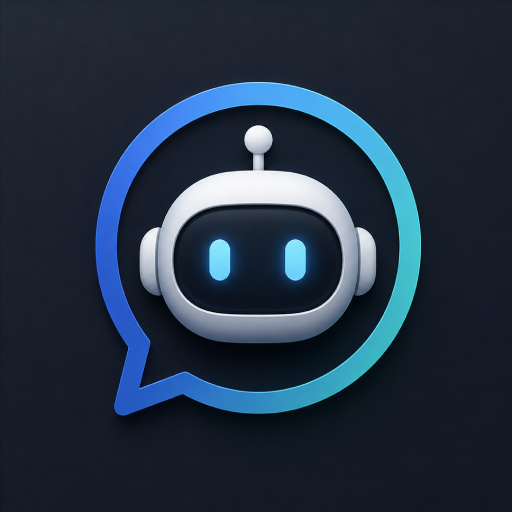

# AI Agents for DynamicLake

<p align="center"></p>

**A DynamicLake Pro plugin for Codex, Claude Code, and OpenCode.** It shows the latest local agent session as a Live Activity and Sneak Peek, with working, thinking, tool, response, and completion states derived from local session metadata. Agent logos are bundled for offline display, with ChatGPT/Codex and Claude/Claude Code choices.

This is an independent plugin maintained by Rafael Reverberi; it is not affiliated with DynamicLake, OpenAI, Anthropic, or OpenCode. The existing plugin identifier is retained so installations of earlier versions can be updated in place.

## Requirements

- DynamicLake Pro with JSON plugin support on macOS.
- Python 3.10 or newer available as `python3` for the plugin executable.
- At least one of Codex, Claude Code, or OpenCode installed and writing local sessions. An agent without a recent session simply has no activity.

## Install or update

1. Download `AI-Agents-1.5.0.zip` from the [v1.5.0 GitHub release](https://github.com/rafaelreverberi/dynamiclake-ai-agents-plugin/releases/tag/v1.5.0) and extract it. The ZIP contains `AIAgents.dynamiclakeplugin`.
2. In DynamicLake Pro, open **Settings → Plugins → Install Local** and select that extracted plugin folder.
3. Confirm the local plugin installation and enable **AI Agents** in Plugin Status. If an older copy remains active after updating, turn it off and back on there.

The ZIP's `AI-Agents-1.5.0.zip.sha256` companion file lets you check the download with `shasum -a 256 -c AI-Agents-1.5.0.zip.sha256` from the same directory. You can also install the `AIAgents.dynamiclakeplugin` folder directly from this repository checkout.

The plugin identifier remains `com.dynamiclake.plugins.ai-agents`; its version in `plugin.json` is **1.5.0**. Reinstalling the package keeps the same plugin identity. The ZIP contains the plugin folder at its top level.

## Settings and display

DynamicLake provides **Codex** and **Claude** switches in its built-in **AI Agents** section. The plugin adds **OpenCode**, **Show agent logos**, and two logo dropdowns under **Plugin Settings**, so Codex and Claude source switches do not appear twice.

| Setting | Location | Default | Effect |
| --- | --- | --- | --- |
| Codex | AI Agents | On | Monitor Codex sessions. |
| Claude | AI Agents | On | Monitor Claude Code sessions. |
| OpenCode | Plugin Settings | On | Monitor OpenCode sessions. |
| Show agent logos | Plugin Settings | Off | Show the agent logo on the left of the main Live Activity and Sneak Peek. On completion, retain that logo and show a green checkmark on the right. |
| Codex logo | Plugin Settings | ChatGPT | Choose the existing ChatGPT/OpenAI mark or the Codex cloud logo. |
| Claude logo | Plugin Settings | Claude | Choose the existing Claude mark or the Claude Code mascot. |

The minimized side capsule always shows the selected agent logo, whether **Show agent logos** is on or off and whether the session is working or completed. Logo and source changes take effect while the plugin is running; switching a source off dismisses its activity.

With **Show agent logos** off, the main view retains its activity SF Symbols and progress indicator. Completed activities remain visible for 20 seconds by default; other sessions stop showing after 90 seconds without an update.

When the plugin starts, it clears any old Live Activity that no longer has an active session. Codex settings or other metadata updates do not restart the completion timer. Large Codex session logs are parsed without carrying an unrelated old turn into the latest activity state.

## Data and privacy

The plugin reads Codex and Claude JSONL session files and OpenCode's local SQLite database. Its OpenCode connection uses read-only mode. DynamicLake receives the agent name, project folder name, activity phase/detail, and predefined UI components. The plugin does not send prompts, responses, tool output, credentials, or full project paths in its activity messages. The project folder name can still be sensitive if it contains private information.

The bundled logos are loaded from the plugin package; the monitor makes no network requests for them. The Codex and Claude Code variants use the transparent images supplied for this update. Their sources and usage notes are in [ASSETS.md](ASSETS.md).

The plugin does not require an API key or an online account. It reads only local agent session metadata and sends its Live Activity payloads to the locally running DynamicLake app.

## Optional environment configuration

DynamicLake passes the built-in Codex and Claude switches as `AI_AGENTS_ENABLE_CODEX` and `AI_AGENTS_ENABLE_CLAUDE`. For manual launches, setting either to `0` disables that source; `AI_AGENTS_ENABLE_OPENCODE=0` is the fallback when no saved OpenCode plugin setting exists. `DYNAMICLAKE_SETTING_SHOW_AGENT_LOGOS=1` enables the main-view logo option without saved settings.

OpenCode data defaults to `$XDG_DATA_HOME/opencode` or `~/.local/share/opencode`; `OPENCODE_DB` can select another database path. `AI_AGENTS_STALE_SECONDS` defaults to 90 seconds and `AI_AGENTS_COMPLETED_VISIBLE_SECONDS` defaults to 20 seconds.

## Checks and package build

Run from this repository directory:

```sh
PYTHONDONTWRITEBYTECODE=1 python3 -m unittest discover -s tests -v
./AIAgents.dynamiclakeplugin/ai-agents-monitor.py --check
python3 scripts/build_release.py
cd dist && shasum -a 256 -c AI-Agents-1.5.0.zip.sha256
```

`--check` prints local agent and project names; use it only where that output is appropriate. `--demo-json` prints the JSON for currently active sessions. The package builder checks the manifest, assets, executable bit, size limits, and ZIP integrity, then writes `dist/AI-Agents-1.5.0.zip` and its SHA-256 file.

See [CHANGELOG.md](CHANGELOG.md) for the 1.5.0 changes.

## Repository and releases

The plugin package lives in `AIAgents.dynamiclakeplugin/`. `scripts/build_release.py` validates the DynamicLake JSON manifest, executable, and image assets, runs the unit tests, and creates the installable ZIP plus checksum. GitHub Actions runs the same validation on pushes and pull requests. Releases attach the built ZIP and checksum; GitHub's automatically generated source archives are not installable plugins.

Problems that might expose local session metadata should be reported privately, following [SECURITY.md](SECURITY.md). Do not paste prompts, raw session logs, tokens, or project paths into an issue.

## Distribution rights

This repository does not grant a source license. The original source of the package icon is not documented, and the agent marks have separate trademark and brand terms; see [ASSETS.md](ASSETS.md). Redistribution rights for those assets are not granted here.
